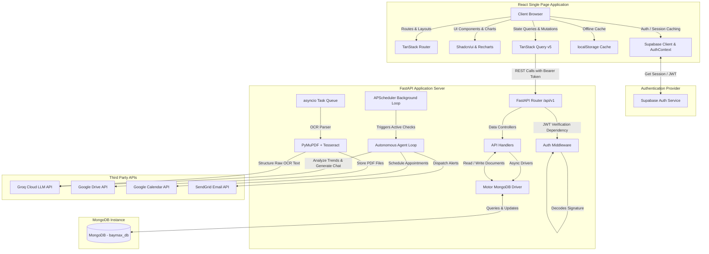

# 🎓 Study Guide & Architectural Blueprint: BayMax – Healthcare Buddy

This document serves as a comprehensive educational guide and technical blueprint for **BayMax – Healthcare Buddy**. It outlines the complete system architecture, core design patterns, technology stack, and critical programming concepts required to understand, build, and maintain this application. 

If you feed this document into any Advanced LLM, it will be equipped with the context and structured outline necessary to teach you the entire system.

---

## 🗺️ 1. High-Level System Architecture

BayMax is an **autonomous, offline-first health monitoring assistant** consisting of:
1. A single-page web app built with React, TanStack Start/Router, and Tailwind CSS.
2. An asynchronous API server built with FastAPI and MongoDB.
3. Third-party authentication via Supabase Auth.
4. An autonomous AI Agent (LangChain + Groq) that monitors patients in the background.
5. Asynchronous document OCR pipelines (Tesseract + PyMuPDF).
6. Calendar scheduling (Google Calendar) and notification alerts (SendGrid).

### 🔄 System Component Topology



---

## 🛠️ 2. Core Frontend Technical Stack

To build the frontend, you must master the modern React SPA ecosystem, focused on type safety, file-based routing, and declarative server state synchronization.

### 2.1 File-Based Routing (TanStack Router)
Unlike traditional path-matching routers (like React Router), TanStack Router uses code generation to enforce compile-time type safety for routes, path parameters, and query parameters.
* **Concepts to Learn**:
  * **Layout Routes (`__root.tsx`)**: Managing nested templates, global navigation headers, footers, and context providers (e.g., `<AuthProvider>`).
  * **Path & Query Parameter Parsing**: Defining route parameters like `/history?page=1&page_size=20` and mapping them to strongly-typed TypeScript interfaces.
  * **Loaders**: Fetching data before route transitions occur to avoid waterfall loading states.
  * **Guards & Redirects**: Intercepting route transitions (e.g., checking if the user is onboarded, redirecting unauthenticated users to `/login`).

### 2.2 Server State Management (TanStack Query v5)
The application separates local UI state (modal open/closed, current form input) from server state (patient vitals history, chat messages, compliance logs).
* **Concepts to Learn**:
  * **Declarative Data Fetching**: Using `useQuery` mapped to specific query keys (e.g., `['vitals', 'trend', days]`).
  * **Mutations & Cache Invalidation**: Using `useMutation` to submit new data (e.g., `vitalsApi.log`), followed by automatic trigger of `queryClient.invalidateQueries` to refresh stale charts and list views.
  * **Stale Time & Garbage Collection**: Setting options to prevent redundant backend calls while preserving UI responsiveness.

### 2.3 Client-Side Authentication (Supabase Auth)
The frontend utilizes the `@supabase/supabase-js` SDK to delegate password management, email confirmation, and session lifecycles.
* **Concepts to Learn**:
  * **OAuth & Auth Events**: Handling authorization transitions using `onAuthStateChange` listeners.
  * **Token Caching**: Extracting the JSON Web Token (JWT) from the active session and writing it to `localStorage` under `KEYS.authToken`.
  * **Authentication Context Providers**: Wrapping the component tree in an `AuthContext` to expose `user`, `isDemo`, `signIn`, and `signOut` state globally.

### 2.4 Offline-First Synchronization & Caching
Because medical logging might occur with intermittent connection, onboarding and metrics settings are cached in browser `localStorage`.
* **Concepts to Learn**:
  * **Local State Syncer Hooks**: Implementing custom state hooks (`useLocalState`) that listen to `window.addEventListener("storage")` to keep multiple tabs or components in sync.
  * **Profile Merging Pattern**: Onboarding metrics and profile changes are serialized locally, then sent to the backend via `syncProfileToBackend()` on login or when settings are saved.

### 2.5 Dynamic Layouts & Charts (Tailwind v4 & Recharts)
* **Concepts to Learn**:
  * **Design Tokens & Theme Constants**: Setting up tailwind theme variables (e.g., `rose` for menstrual cycle, custom alert colors).
  * **Recharts Integration**: Mapping raw JSON arrays into dynamic responsive elements (`<ResponsiveContainer>`, `<LineChart>`, `<Tooltip>`).

---

## 🐍 3. Core Backend Technical Stack

The backend is built around FastAPI's asynchronous architecture, using Python typing, async MongoDB, and secure encryption.

### 3.1 Asynchronous FastAPI Web Framework
FastAPI leverages Python's `asyncio` loop to handle thousands of concurrent requests by avoiding blocking I/O calls.
* **Concepts to Learn**:
  * **Lifespan Context Manager (`@asynccontextmanager`)**: Executing startup sequences (connecting to MongoDB, starting background scheduler) and shutdown cleanups (closing database pools, stopping scheduler) safely.
  * **Dependency Injection (`Depends`)**: Resolving authenticated user IDs dynamically in route handlers (e.g., `user_id: str = Depends(get_current_user)`).
  * **Global Exception Handler**: Mapping unexpected tracebacks to standardized JSON error responses.

### 3.2 Asynchronous MongoDB (Motor Driver)
Motor provides an `asyncio`-friendly interface to MongoDB, avoiding thread pool contention.
* **Concepts to Learn**:
  * **Collections & Indexes**: Setting up collections (`users`, `vitals`, `compliance_logs`, `cycle_logs`, `reports`, `agent_logs`, `chat_history`).
  * **Aggregations & Date Queries**: Filtering, sorting (`sort("timestamp", -1)`), and paginating documents asynchronously with cursors (`skip()`, `limit()`).
  * **Atomic Operations (Upserts)**: Using `update_one` with `upsert=True` to store compliance logs uniquely per day (`{"user_id": ..., "date": ..., "measure": ...}`).

### 3.3 Symmetric Fernet Encryption
To protect user privacy, BayMax allows users to configure their own Groq AI keys, which are encrypted prior to being stored in the database.
* **Concepts to Learn**:
  * **Fernet Symmetric Cryptography (`cryptography.fernet`)**: Generating keys, encoding plaintext keys to byte streams, and performing decryption at runtime.
  * **Decryption Error Resilience**: Falling back to global server keys if a user's local key fails to decrypt or is absent.

### 3.4 Custom Authentication Middleware & JWT Validation
Instead of direct database session validation, FastAPI inspects incoming Supabase JWT tokens.
* **Concepts to Learn**:
  * **JWT Decoding (`python-jose`)**: Parsing JWT headers, verifying claims, and extracting the subject (`sub`) uuid corresponding to the Supabase Auth UUID.
  * **RS256 Public Key Cryptography**: Configuring FastAPI to verify signatures using Supabase JWKS (JSON Web Key Sets), with a development mode override (`DEVELOPMENT_MODE=true`) for testing.

---

## 🤖 4. AI & Agentic Workflows

BayMax relies on autonomous background cycles and chat-agent loops built with LangChain and Groq.

```
                  ┌──────────────────────────────┐
                  │      APScheduler Trigger     │
                  └──────────────┬───────────────┘
                                 │
                                 ▼
                  ┌──────────────────────────────┐
                  │    Extract User Context:     │
                  │   - Doctor Instructions      │
                  │   - Recent Vitals (7d)       │
                  │   - Today's Compliance       │
                  │   - Profile Data             │
                  └──────────────┬───────────────┘
                                 │
                                 ▼
                  ┌──────────────────────────────┐
                  │  Instantiate LLM & Executor  │
                  │   (ReAct Loop, max_iter=4)   │
                  └──────────────┬───────────────┘
                                 │
          ┌──────────────────────┴──────────────────────┐
          ▼                                             ▼
┌──────────────────┐                           ┌──────────────────┐
│  Reasoning Step  │                           │   Action Stage   │
│  "Thought: ..."  │ ──► [Evaluate Tools] ──►  │ "Action Input"   │
└──────────────────┘                           └────────┬─────────┘
        ▲                                               │
        │             [Execute Tool Function]           │
        └───────────────────────────────────────────────┘
                                 │ (Finished or max reached)
                                 ▼
                  ┌──────────────────────────────┐
                  │        Final Answer:         │
                  │    - Save Clinical Summary   │
                  │    - Log Agent Activity      │
                  └──────────────────────────────┘
```

### 4.1 LangChain ReAct Agents
The agent follows the ReAct (Reasoning and Acting) paradigm to decide which database tools to call dynamically based on the patient's rules and state.
* **Concepts to Learn**:
  * **Prompt Engineering (Mandates vs. Hard Boundaries)**: Defining strict instructions so the LLM acts as an objective monitoring pipeline and NEVER diagnoses diseases or prescribes treatments.
  * **ReAct String Formats**: Formatting the thought process strictly (`Thought`, `Action`, `Action Input`, `Observation`, `Final Answer`) to avoid parser crashes.
  * **Capping Executions**: Setting `max_iterations` and timeouts to protect LLM rate limits and budget.

### 4.2 Creating Custom Agent Tools
Every capability the agent has (accessing vitals, sending alerts, logging actions) is defined as a Python function wrapped in a LangChain `@tool` decorator.
* **Concepts to Learn**:
  * **Self-Validating Tools**: Parsing unstructured string arguments into JSON parameters safely inside the tool.
  * **MongoDB Tool Adapters**: Linking tool triggers directly to async database queries (e.g., retrieving cycle records, inserting alert documents).

### 4.3 Conversation Memory & Session Continuity
For interactive user chats, the LLM must remember the history of current messages without overwhelming the request context.
* **Concepts to Learn**:
  * **MongoDB Conversation Message History**: Serializing, writing, and reloading messages (`user` / `assistant` / `system`) per session.
  * **Context Window Truncation**: Paginating and keeping message arrays bound to LLM token budget.

### 4.4 Asynchronous Schedulers (APScheduler)
A background system must routinely inspect patient profiles without blocking the main web server.
* **Concepts to Learn**:
  * **Interval Triggers**: Executing jobs every N minutes.
  * **Pacing & Rate-Limit Handling**: Introducing sleep delays (`asyncio.sleep`) between user checks to avoid exhaustively hitting the Groq API rate limits (RPM/TPM).

---

## 📄 5. Data Pipelines & Document Processing

Patients can upload medical reports (PDF/images) to parse vital parameters automatically.

### 5.1 Document OCR Pipeline
* **Concepts to Learn**:
  * **Multipage Parsing (PyMuPDF / Fitz)**: Converting pages in a PDF document into raw text streams or image assets.
  * **Tesseract OCR Integration (`pytesseract`)**: Running optical character recognition over scanned images or non-selectable PDFs.
  * **Memory Pipelining**: Loading uploaded files directly from memory buffers as byte streams, avoiding disk I/O.

### 5.2 LLM Structured Extraction
Raw text output from OCR engines is noisy, unstructured, and filled with formatting errors.
* **Concepts to Learn**:
  * **Schema Enforcement**: Instructing an LLM to extract key vitals (blood pressure, heart rate, blood glucose) and return them strictly formatted as valid JSON matching a Pydantic model.
  * **Post-processing Hooks**: Merging extracted OCR vitals directly into the patient's primary `vitals` log stream.

---

## 🔌 6. Third-Party Integrations

### 6.1 Google Workspace APIs (Drive & Calendar)
* **Concepts to Learn**:
  * **Service Account Authentication**: Constructing an API client using a JSON service account secret file credentials.
  * **File Upload Streams (Drive API)**: Pushing byte streams to target shared folder IDs.
  * **Dynamic Calendar Reminders (Calendar API)**: Using Regex parsing inside Python to extract action points from clinical text (e.g., "Check blood pressure every Monday at 9 AM") and creating calendar events automatically.

### 6.2 SendGrid Email Alerts
* **Concepts to Learn**:
  * **Mail Routing**: Sending automated warning alerts to a user's designated emergency contact.
  * **Development Stubs**: Writing code that outputs email payloads to log streams when API keys are absent, ensuring developers do not require active accounts to run the project.

---

## 🔄 7. End-to-End Core Request Flows

### 7.1 Onboarding & Settings Synchronization Flow
How data flows from the multi-step frontend wizard to MongoDB:

```
[Onboarding Forms] 
       │ ──► writes details individually to local React State
       │
[LocalStorage Cache]
       │ ──► writeLS(KEYS.profile / KEYS.meds / KEYS.conditions)
       │
[syncProfileToBackend() Invocation]
       │ ──► Fetch cached values from localStorage
       │ ──► POST /api/v1/users/profile (Bearer JWT Token)
       │
[FastAPI Route Handler]
       │ ──► Decodes JWT token, gets user_id
       │ ──► Encrypts Groq API Key using Fernet Key
       │ ──► Performs Atomic Upsert on users collection
       │ ──► If doctor instructions changed → trigger Google Calendar reminder creation
       │
[MongoDB Persistence]
       │ ──► Stores encrypted profile, conditions, medications, instructions
```

### 7.2 Medical Report Upload & Asynchronous OCR Processing Flow

```
[User Interface] ──► Upload PDF/Image
                       │
[Frontend Client] ──► POST /api/v1/reports/upload (multipart/form-data)
                       │
[FastAPI Server]
     │
     ├── 1. Verify Authentication JWT
     ├── 2. Upload file bytes to Google Drive Folder (Drive API)
     ├── 3. Write MongoDB Report Document: { parsed: false }
     ├── 4. Return "202 Accepted" status back to Frontend (UI shows "Parsing...")
     │
     └── 5. Dispatch async background task (asyncio.create_task)
              │
              ▼
    [Background Worker Process]
              ├─ Download file from Google Drive
              ├─ Extract text via PyMuPDF (PDF) or Tesseract (Image)
              ├─ Prompt Groq to extract structured vitals JSON from raw text
              ├─ Store extracted vitals in MongoDB Report Document
              └─ Update MongoDB Report: { parsed: true }
```

---

## 📅 8. Step-by-Step Developer Study Curriculum

To build this project from scratch, master these concepts in order:

### Phase 1: Foundations (Database & Backend)
1. **Learn MongoDB**: Setup a local instance, learn document database concepts, collections, and simple BSON queries.
2. **Build Python APIs**: Build a simple FastAPI app. Master async path definitions, route models (`Pydantic`), and the lifespan context manager.
3. **Connect API to Database**: Learn how to use `Motor` for asynchronous database connections. Implement basic CRUD operations (e.g. logging and reading vitals).

### Phase 2: User Access & Cryptography
4. **JWT Authentication**: Learn how JWTs work. Learn to verify signatures, decode claims, and write custom dependencies in FastAPI. Set up a Supabase project and use its API.
5. **Encryption**: Understand symmetric vs. asymmetric encryption. Implement Fernet encryption to store sensitive strings securely.

### Phase 3: Core Frontend (React, Routing, & State)
6. **Learn TanStack Router**: Build a multi-page React application with file-based routing. Implement protected layouts and navigation guards.
7. **Learn TanStack Query**: Fetch backend data using queries. Implement mutations that write data and invalidate query keys to refresh states.
8. **Integrate Auth Context**: Connect your React app to Supabase. Cache active JWTs in `localStorage` and attach them to fetch requests.

### Phase 4: Document Parsing & Scheduling
9. **Build an OCR pipeline**: Write a standalone script to extract text from a PDF or image using `Tesseract` and `fitz`. Use an LLM API to format the raw text output into structured JSON.
10. **Build a Scheduler**: Set up `APScheduler` in Python. Run a simple job on an interval trigger and learn to query active users.

### Phase 5: Autonomous AI Agentic Loop
11. **Master LangChain**: Build a simple agent with LangChain. Learn the difference between System Messages, Prompt Templates, and Chains.
12. **Build Custom Tools**: Write python functions, wrap them as LangChain tools, and register them with the agent executor.
13. **Combine System**: Wire the scheduler to execute the LangChain agent. Let the agent query vitals, check compliance schedules, log activities, and dispatch email alerts to third-party APIs.
